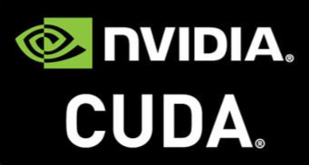

# Hi, welcome to my GitHub!!

# 💫 About Me:
🔭 I’m currently working on 👯 I’m looking to collaborate on 🤝 I’m looking for help with 🌱 I’m currently learning 💬 Ask me about ⚡ Fun fact

# 🌐 Socials:

  
  

# 💻 Tech Stack:

### Programming Languages:

### AI/ML Tools:

### Deep Learning Frameworks:

### Development Tools:

### Video Games Development:

### What I am currently learning / improving on:

 

# 📊 GitHub Stats:
 
 

